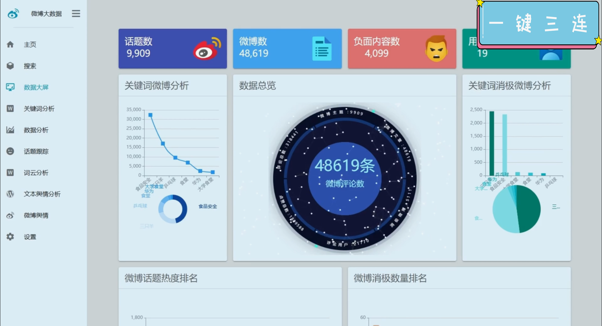

## 计算机毕业设计Python+大模型微博舆情分析 BERT模型深度学习情感分析 机器学习 Scrapy Django Vue.js tfidf textrank 大数据毕业设计

## 要求
### 源码有偿！一套(论文 PPT 源码+sql脚本+教程)

### 
### 加好友前帮忙start一下，并备注github有偿bert微博分析
### 我的QQ号是2827724252或者798059319或者 1679232425或者微信:bysj2023nb

# 

### 加qq好友说明（被部分 网友整得心力交瘁）：
    1.加好友务必按照格式备注
    2.避免浪费各自的时间！
    3.当“客服”不容易，repo 主是体面人，不爆粗，性格好，文明人。
## 创新点
（1）舆情分析与跟踪：针对scrapy爬取到的微博内容，可以根据BERT深度学习情感分析结果进行各种分析，可以订阅关注的话题，就行跟踪，还可以对自己已经收藏的话题生成舆情word报告，查看各种类型微博比例和舆情发展趋势结果。
（2）内容分析功能： 对话题的观点、关键词、热度进行分析，利用多种图形来进行分析，针对微博内容提取观点，包括统计方法、tfidf、textrank等。
（3）全新可视化功能：全新改进的可视化界面效果，尤其在爬取时进行数据预处理加上后台SQL优化，系统响应极大提升。

## 演示视频
https://www.bilibili.com/video/BV1hx1YYPEBm/

## 截图

